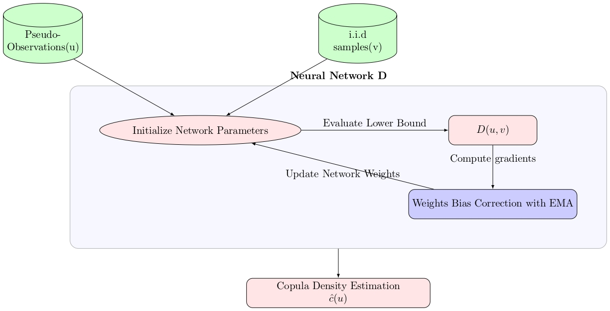
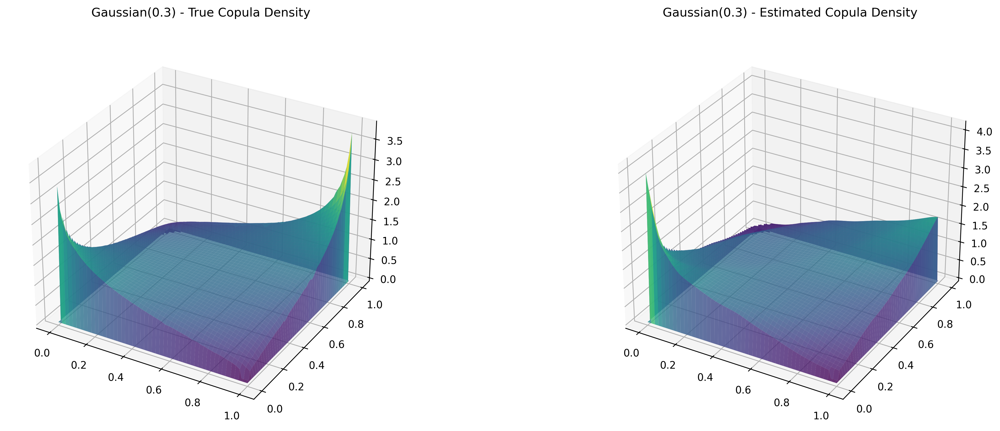
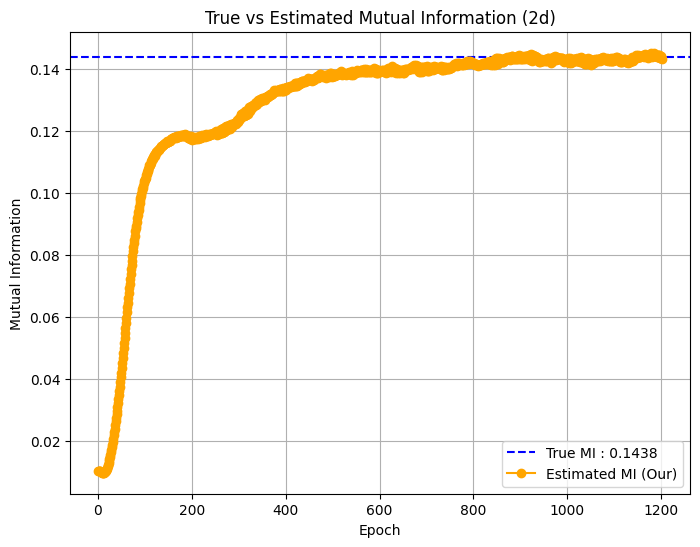
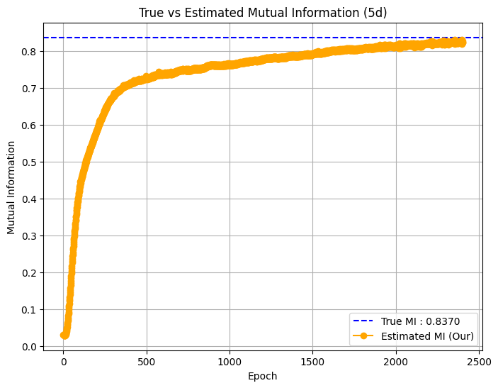
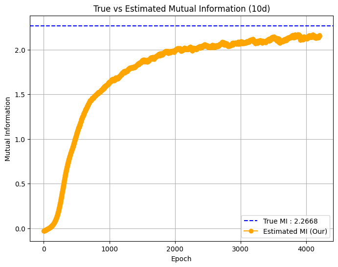

# Learning-High-Dimensional-Copula-Densities-with-Unsupervised-Neural-Networks
This repository provides code for an unsupervised deep-learning method that models high-dimensional copula densities and enables mutual-information estimation at scale.

# Datasets
This project uses both synthetic and real datasets. The real datasets are available in the data/ folder.
# Installation
The implemented code is developed in python 3.11.5 environement

To install all required dependencies, run the following pip command:
```bash
pip install -r requirements.txt
```
# Results
 
# High dimensioanl Mutual information Estimation 
<p align="center">
  
  
  
</p>

